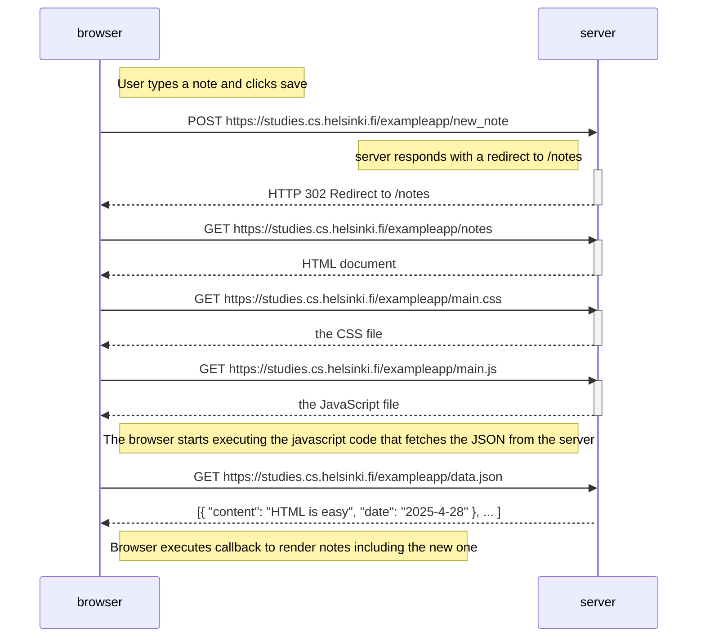

```mermaid

sequenceDiagram
    participant browser
    participant server

    Note right of browser: User types a note and clicks save
    browser->>server: POST https://studies.cs.helsinki.fi/exampleapp/new_note
    Note left of server: server responds with a redirect to /notes
    activate server
    server-->>browser: HTTP 302 Redirect to /notes
    deactivate server

    browser->>server: GET https://studies.cs.helsinki.fi/exampleapp/notes
    activate server
    server-->>browser: HTML document
    deactivate server

    browser->>server: GET https://studies.cs.helsinki.fi/exampleapp/main.css
    activate server
    server-->>browser: the CSS file
    deactivate server

    browser->>server: GET https://studies.cs.helsinki.fi/exampleapp/main.js
    activate server
    server-->>browser: the JavaScript file
    deactivate server

    Note right of browser: The browser starts executing the javascript code that fetches the JSON from the server

    browser->>server: GET https://studies.cs.helsinki.fi/exampleapp/data.json
    activate server
    server-->>browser: [{ "content": "HTML is easy", "date": "2025-4-28" }, ... ]

    Note right of browser: Browser executes callback to render notes including the new one

```
